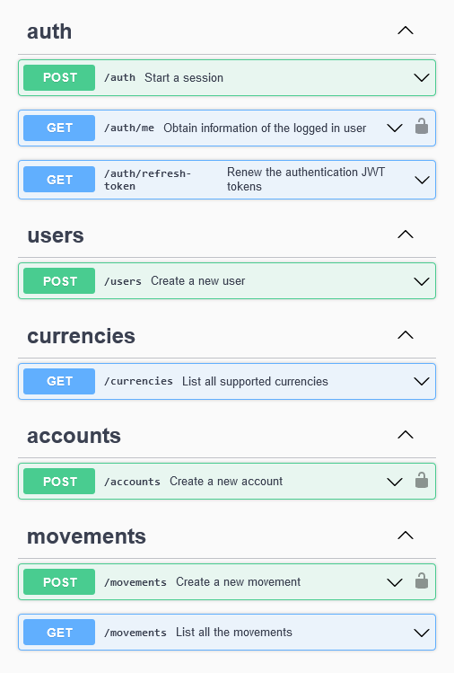

# Virtual Wallet - **[Go to the App](https://challenge-full-stack-alkemy-backend.vercel.app/swagger#/)**



## Cosas que puse en practica

- Implementacion de arquitecturas limpias (DDD).

- Manejo de errores en la capa de Aplicación (Casos de uso).

- Validacion de entrada y salida de datos.

- Documentacion a travez de Open API (Swagger).

- Modelado de dominio.

- Casos de uso transaccionales.

## Tech Stack

- [NestJS](https://nestjs.com/)
- [Zod](https://zod.dev/)
- [Passport](https://www.passportjs.org/)
- [Prisma](https://www.prisma.io/)

## Variables de entorno

Para iniciar este proyecto, tendras que añadir las siguientes variables de entorno a tu archivo .env.development.local

`DATABASE_URL`

`JWT_ACCESSS_TOKEN_SECRET`

`JWT_REFRESH_TOKEN_SECRET`

## Como iniciar el proyecto

Clonar el proyecto

```bash
  git clone https://github.com/JPerezC92/virtual-wallet-api.git
```

Ir al directorio del proyecto

```bash
  cd virtual-wallet-api
```

Instalar las dependencias

```bash
  npm install
```

Iniciar la aplicación

```bash
  npm run start:dev
```
